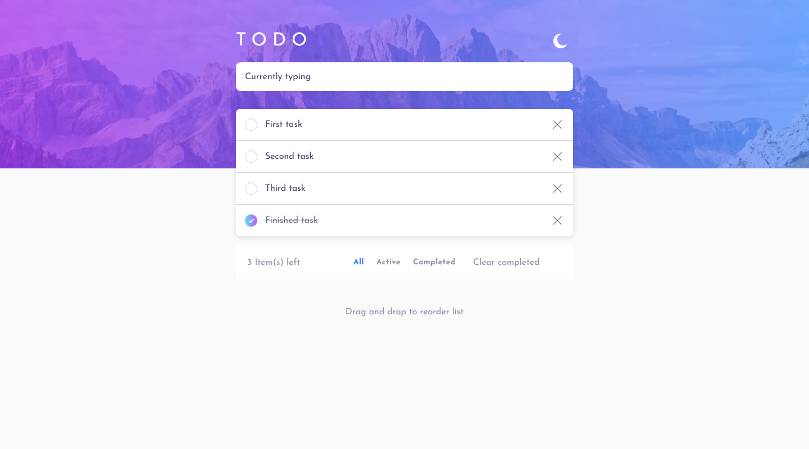
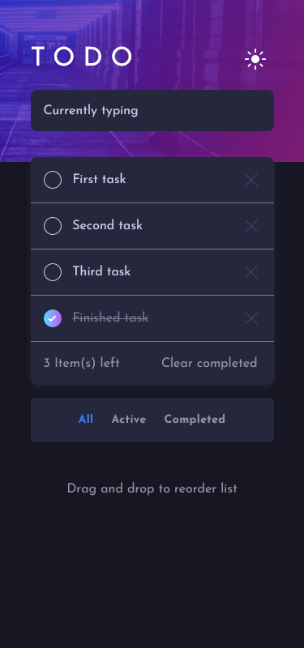

# Frontend Mentor - Todo app solution

This is a solution to the [Todo app challenge on Frontend Mentor](https://www.frontendmentor.io/challenges/todo-app-Su1_KokOW). Frontend Mentor challenges help you improve your coding skills by building realistic projects. 

## Table of contents

- [Overview](#overview)
  - [The challenge](#the-challenge)
  - [Screenshot](#screenshot)
  - [Links](#links)
- [My process](#my-process)
  - [Built with](#built-with)
  - [What I learned](#what-i-learned)
  - [Useful resources](#useful-resources)
- [Author](#author)

## Overview

### The challenge

Users should be able to:

- View the optimal layout for the app depending on their device's screen size
- See hover states for all interactive elements on the page
- Add new todos to the list
- Mark todos as complete
- Delete todos from the list
- Filter by all/active/complete todos
- Clear all completed todos
- Toggle light and dark mode
- **Bonus**: Drag and drop to reorder items on the list

### Screenshot

### Links

- [Solution URL](https://github.com/notFaceroll/todo-app)
- [Live Site UR](https://notfacerolls-not-a-todo.netlify.app/)

## My process

### Built with

- Semantic HTML5 markup
- CSS custom properties
- Flexbox
- CSS Grid
- Mobile-first workflow
- [React](https://reactjs.org/) - JS library
- [Styled Components](https://styled-components.com/) - For styles
- [Framer](https://www.framer.com/) - For animations
- [react-beautiful-dnd](https://github.com/atlassian/react-beautiful-dnd) - For the dragging feature on the list
- [MUI](https://mui.com/) - For some of the components

### What I learned

For me, at the very early stages of a continuous learning process, it was definitely a good project to practice the fundamental features of React. I really enjoyed working on this, even tho it's a simple application. Could practice the basic hooks and had the chance to use a custom hook to store the actual ToDos on localstorage plus the chosen theme.

### Useful resources

- [Convert a color](https://convertacolor.com/) - ez color picker.
- [useHooks](https://usehooks.com/) - React Hook recipes by ui.dev

## Author

- Frontend Mentor - [@notFaceroll](https://www.frontendmentor.io/profile/notFaceroll)
